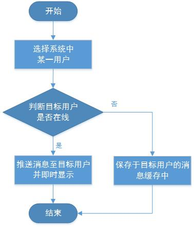

## 网络通信服务器

### 一、需求分析

#### 1.  系统规格说明

（1）系统概貌：网络通信服务器主要由硬件和软件两部分构成，如图1.1。硬件部分主要由处理器、存储器、外部设备等组成；软件部分主要由系统软件和聊天应用软件组成。

​									图1.1 功能需求

（2）功能需求：能够支撑多人在线通信，支持单聊，群聊等不同方式，如图1.2所示。

​									图1.2 功能需求

​	在本系统中，主要针对局域网进行通信，待开发的功能主要有：注册、登录、单聊、群聊、用户管理等，相应描述如下：

- 注册：用户提交自己的身份信息（诸如用户名、密码、身份证号、手机号等）进行注册，如果该用户信息尚未注册，则由服务器存储其身份信息，注册成功，显示用户界面，否则注册失败，返回继续注册，如图1.3所示。

​									图1.3 用户注册

- 登录：用户使用用户名和密码进行登录，如图1.4，成功登陆后显示该系统的所有成员，成员中分为在线成员和非在线成员，同时显示该用户加入的全部群组。如果用户有未读的离线消息，则在用户登录后，这些离线消息将第一时间显示出来。

​										图1.4 用户登录

- 单聊：用户可以选择当前系统中的一位成员进行聊天，如图1.5。如果目标成员在线，则发送的消息会经由服务器立即推送到该目标成员；如果目标成员不在线（即处于离线状态），则该消息会由服务器保存在该目标成员的消息缓存中，目标成员一旦上线，服务器便会将离线消息第一时间推送过去。

​									图1.5 单聊

- 群聊：用户可以选取系统中的若干成员组成群组，如图1.6，用户发送消息时，在线的群组成员会立即收到该消息，而对于离线的群组成员，该消息将会存储于其消息缓存中，一经上线便会收到服务器的推送。

​									图1.6 群聊

- 用户管理：系统中内设管理员，主要职责为：对新用户的注册申请进行处理，同意合法用户的申请，并将用户信息写入用户数据库，对于非法用户则拒绝其申请；当系统中某一用户离开时，从用户数据库中及时删除其信息。

（3）运行需求：运行在Win7及更高版本的Windows操作系统。

（4）接口需求：提供详细的接口设计，至少能够让第三方根据设计开发客户端进行通讯。

#### 2.  数据要求

数据元素：主要包括用户编号、群组编号等。

> 名字：用户编号
>
> 别名：用户ID
>
> 描述：唯一地标识使用聊天通信应用软件的一个用户
>
> 定义：用户编号=11{字符}11
>
> 位置：消息
>
> ​            用户数据库

> 名字：群组编号
>
> 别名：群ID
>
> 描述：唯一地标识使用聊天通信应用软件的一个群组
>
> 定义：消息编号=1{字符}8
>
> 位置：消息
>
> ​	    群组数据库

### 二、 整体设计

#### 1.  系统整体流程图

​	系统整体流程图如图2.1。首先，用户输入用户名和密码进行登录，如果是已注册用户则登陆成功，否则登录失败，进入用户注册流程。成功登陆后，用户可以选择群聊或私聊，如果是私聊，将根据聊天目标是否在线进入相应的流程：聊天目标在线，发送的消息将直接推送给目标；聊天目标不在线，发送的消息将存储于聊天目标的消息接收缓存中，一旦聊天目标上线，这些缓存消息将立即推送给聊天目标。如果是群聊，此时需要遍历群内的所有成员，对于每个群成员的处理过程同单聊。

​								图2.1 系统整体流程

#### 2.  模块设计

系统总共分为以下注册、登录、聊天、用户管理四个模块。

（1）注册模块

​	用户注册过程如图2.2。用户输入自定义的用户名、用户密码以及用户手机号进行注册，然后服务器存储这些用户数据到数据库中，并将用户手机号作为用户在系统中的全局唯一编号。

​									图2.2 用户注册

（2）登录模块

​	用户登录过程如图2.3。用户输入用户ID和用户密码进行登录，然后服务器检查该用户是否是已注册用户（即是否合法），如果是合法用户，则返回给用户当前系统中的所有用户以及该用户加入的所有群组，并显示该用户的离线消息。

​									图2.3 用户登录

（3）聊天模块

​	聊天过程如图2.4。发送用户首先选择接收用户，发送一条消息，服务器检查接收用户是否在线，如果在线，则将消息、发送用户ID和发送时间直接推送给接收用户；如果接收用户离线，则将消息、发送用户ID和发送时间打包存储于接收用户的接收消息缓存中。

​									图2.4 用户聊天

### 三、详细设计

#### 1.  消息格式

通信采用WebSocket实现，传输的消息采用Json进行封装，结构如下：

{

​	method : "xxx",

​	param : {

​		...

​	}	

}

| 参数名 | 参数含义                 | 参数类型 | 必选 |
| ------ | ------------------------ | -------- | ---- |
| method | 表明此次传输的消息的用途 | String   | 是   |
| param  | 表明此次传输的消息的内容 |          |      |

#### 2.数据库定义

数据库采用ElasticSearch，共分为用户数据库和群组数据库。

（1）用户数据库格式为：

{

userID: "xxx",

userPasswd: "yyy",

joinedGroup: ["aaa", "bbb", "ccc"],

unreadMessage: [],

lastLoginTime: "zzz"

}

其中，userID、userPasswd和lastLoginTime均是string类型，joinedGroup和unreadMessage是数组类型。

- userID表示用户的唯一标识；

- userPasswd表示用户密码；

- joinedGroup表示该用户加入的所有群组，如上表明用户加入了aaa、bbb、ccc三个群组；

- unreadMessage表示用户的个人未读消息，其每个元素组成为：

  {

  ​	senderID: { sendTime1: data1, sendTime2: data2, ...}

  }

  senderID表示消息的发送者ID，sendTime表示消息发送的时间（以服务器收到该消息为准）， data表明此次消息的内容。

- lastLoginTime表示用户上一次退出系统的时间。

（2）群组数据库格式为：

{

groupID: "xxx",

member: ["aaa", "bbb", "ccc"],

message: []

}

其中，groupID是string类型，member和message都是数组类型。

- groupID表示群组的唯一标识；

- member表示该群组的所有用户，如上表明群组有aaa、bbb、ccc三个用户；

- message表示该群组的所有消息，其每个元素组成为：

  {

  ​	sentTime1: {sender1: data1},

  ​	sentTime2: {sender2: data2},

  ​	...

  }

  sentTime、sender、data含义同用户数据库。

#### 3.接口定义

（1）注册

bool userRegister(const string userID, const string userPasswd)

收到的消息格式为

{

​	method : "login",

​	param : {

​		userName: "aaa",

​		userPasswd: "bbb"

​	}

}

| 参数名     | 参数含义                     | 参数类型 | 必选 |
| ---------- | ---------------------------- | -------- | ---- |
| userName   | 表明发起该注册请求的用户ID   | string   | 是   |
| userPasswd | 表明发起该注册请求的用户密码 | string   | 是   |

| 返回值 | 返回值含义 | 返回值类型 |
| ------ | ---------- | ---------- |
| TRUE   | 注册成功   | bool       |
| FALSE  | 注册失败   | bool       |

（2）登录

bool userLogin(const string userID, const string userPasswd)

收到的消息格式为

{

​	method : "register",

​	param : {

​		userName: "xxx",

​		userPasswd:"xxx"

​	}	

}

| 参数名     | 参数含义                     | 参数类型 | 必选 |
| ---------- | ---------------------------- | -------- | ---- |
| userName   | 表明发起该登陆请求的用户ID   | string   | 是   |
| userPasswd | 表明发起该登陆请求的用户密码 | string   | 是   |

| 返回值 | 返回值含义 | 返回值类型 |
| ------ | ---------- | ---------- |
| TRUE   | 登录成功   | bool       |
| FALSE  | 登录失败   | bool       |

在函数返回之前，服务器会传送一些数据给客户端，如下：

- 聊天系统中的所有用户， 格式同群组数据库定义中的member；
- 用户加入的所有群组，同用户数据库定义中的joinedGroup；
- 用户的未读个人消息，同用户数据库定义中的unreadMessage；
- 用户的未读群组消息，格式同群组数据库定义中的message。

（3）单聊

string personalChat(const string srcUserID, const string dstUserID, const string data)

收到的消息格式为

{

​	method : "personChat",

​	param : {

​		dstUserID: "xxx",

​		data: "xxx"

​	}	

}

| 参数名    | 参数含义                 | 参数类型 | 必选 |
| --------- | ------------------------ | -------- | ---- |
| srcUserID | 表明发送该消息的用户ID   | string   | 是   |
| dstUserID | 表明接收该消息的用户ID   | string   | 是   |
| data      | 表明此次传输的消息的内容 | string   | 是   |

| 返回值     | 返回值含义             | 返回值类型 |
| ---------- | ---------------------- | ---------- |
| serverTime | 服务器接收该消息的时间 | string     |
| fail       | 消息发送失败           | string     |

（4）群聊

string groupChat(const string srcUserID, const string groupID, const string data)

对应的消息格式为

{

​	method: "chat",

​	param : {

​		groupID: "xxx",

​		data: "xxx"

​	}

}

| 参数名    | 参数含义                 | 参数类型 | 必选 |
| --------- | ------------------------ | -------- | ---- |
| srcUserID | 表明发送该消息的用户ID   | string   | 是   |
| groupID   | 表明接收该消息的群组ID   | string   | 是   |
| data      | 表明此次传输的消息的内容 | string   | 是   |

| 返回值     | 返回值含义             | 返回值类型 |
| ---------- | ---------------------- | ---------- |
| serverTime | 服务器接收该消息的时间 | string     |
| fail       | 消息发送失败           | string     |
